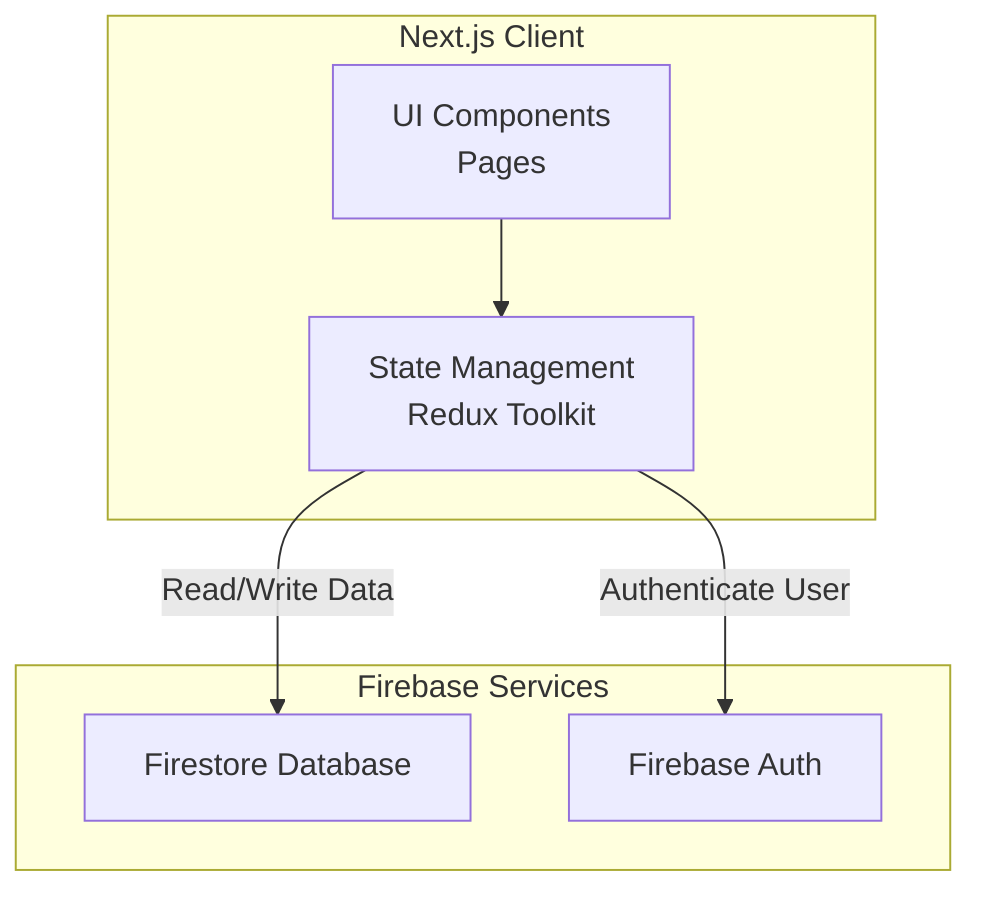

# 🐞 Bug Tracker MVP


A modern, minimal, and efficient bug tracking system built to streamline issue management for development teams and individuals.

---

## 📖 Table of Contents

- [📌 About](#-about)
- [✨ Key Features](#-key-features)
- [🛠 Tech Stack](#-tech-stack)
- [🏗️ Architecture](#️-architecture)
- [🚀 Getting Started](#-getting-started)
- [📂 Project Structure](#-project-structure)
- [🧩 Usage Examples](#-usage-examples)
- [📸 Screenshots](#-screenshots)
- [🛣️ Roadmap](#️-roadmap)
- [🤝 Contributing](#-contributing)
- [📜 License](#-license)

## 📌 About

This project is a **Bug Tracker MVP (Minimum Viable Product)** designed to provide a clear and intuitive way to manage software issues at both **team** and **personal** levels.

It allows users to:
- **Create, assign, update, and resolve** issues with ease.
- **Filter and search** through team issues by status, priority, and text.
- **Manage personal workflows** with dedicated views for "My Bugs," "Assigned to Me," "Critical Issues," and more.
- **Track the complete history** of a bug from creation to resolution.

⚠️ **Disclaimer:** This is a **Minimum Viable Product (MVP)**. It is a fully functional application designed to validate core workflows, user experience, and technical architecture. It is **not the final product**. Advanced features like analytics, notifications, and third-party integrations are planned for future releases.

## ✨ Key Features (MVP)

- **Dual-Scope Views:**
  - **Team Scope:** View and filter all issues across the entire team.
  - **Personal Scope:** Focus on your own work with pre-defined filters in the sidebar.
- **Advanced Filtering & Search:** Combine filters for status (All, Open, In Progress, Resolved) and priority (Low, Medium, High) with a powerful full-text search.
- **Issue Management:** Intuitive CRUD (Create, Read, Update, Delete) operations for issues with real-time updates.
- **Modern UI:** A clean, responsive interface built with shadcn/ui components and TailwindCSS.
- **Real-time Data:** Powered by Firebase Firestore for instant updates across all clients.

## 🛠 Tech Stack

**Frontend:**
- [Next.js](https://nextjs.org/) (App Router) – React framework for production
- [React](https://react.dev/) – UI library
- [Redux Toolkit](https://redux-toolkit.js.org/) – State management
- [TypeScript](https://www.typescriptlang.org/) – Type safety
- [TailwindCSS](https://tailwindcss.com/) – Utility-first CSS styling
- [shadcn/ui](https://ui.shadcn.com/) – Re-usable UI components
- [lucide-react](https://lucide.dev/) – Icon library

**Backend & Infrastructure:**
- [Firebase Firestore](https://firebase.google.com/docs/firestore) – NoSQL database
- [Firebase Auth](https://firebase.google.com/docs/auth) – User authentication

**Developer Tools:**
- ESLint – Code linting
- Prettier – Code formatting

## 🏗️ Architecture

The application follows a client-side rendered architecture with a clear separation of concerns.

- **Presentation Layer (UI):** React components built with TailwindCSS and shadcn/ui.
- **State Layer:** Redux Toolkit manages global state for issues, filters, and user authentication.
- **Data Layer:** Firebase SDK handles all communication with Firestore and Auth services.
- **Persistence Layer:** Firebase Firestore provides the real-time database, while Firebase Auth manages user sessions.



## 🚀 Getting Started

Follow these steps to set up the project locally on your machine.

### Prerequisites

- **Node.js** (v18 or higher)
- **npm** or **yarn** or **pnpm**
- A Firebase project

### Installation

1. **Clone the repository**
   ```bash
   git clone https://github.com/your-username/bug-tracker-mvp.git
   cd bug-tracker-mvp
   ```

2. **Install dependencies**
   ```bash
   npm install
   # or
   yarn install
   # or
   pnpm install
   ```

3. **Set up Firebase**
   - Create a new project in the [Firebase Console](https://console.firebase.google.com/).
   - Enable **Firestore Database** and **Authentication** (e.g., Google provider, Email/Password).
   - Register a new web app in your project settings to get your config object.

4. **Configure environment variables**
   - Create a `.env.local` file in the root directory.
   - Add your Firebase configuration values from the previous step:
   ```bash
   NEXT_PUBLIC_FIREBASE_API_KEY=your_api_key_here
   NEXT_PUBLIC_FIREBASE_AUTH_DOMAIN=your_project_id.firebaseapp.com
   NEXT_PUBLIC_FIREBASE_PROJECT_ID=your_project_id
   NEXT_PUBLIC_FIREBASE_STORAGE_BUCKET=your_project_id.appspot.com
   NEXT_PUBLIC_FIREBASE_MESSAGING_SENDER_ID=your_sender_id
   NEXT_PUBLIC_FIREBASE_APP_ID=your_app_id
   ```

5. **Run the development server**
   ```bash
   npm run dev
   # or
   yarn dev
   # or
   pnpm dev
   ```
6. **Open your browser** and navigate to [http://localhost:3000](http://localhost:3000).

## 📂 Project Structure

```
src/
├── app/                    # Next.js App Router (pages, layouts, loading states)
├── components/            # Reusable React components
│   ├── ui/                # shadcn/ui components
│   ├── Sidebar/           # Navigation sidebar
│   ├── Dashboard/         # Main dashboard components
│   └── Modals/            # Modals for creating/editing issues
├── features/              # Redux Toolkit feature slices
│   ├── issues/            # Issue state & actions
│   ├── filter/            # Filter state & actions
│   └── auth/              # Authentication state
├── lib/                   # Utility libraries and configurations
│   ├── firebase/          # Firebase setup and services (issues, auth)
│   ├── store.ts           # Redux store configuration
│   └── utils.ts           # Helper functions
└── types/                 # Global TypeScript type definitions
```

## 🧩 Usage Examples

### Setting a Personal Filter View
The sidebar links dispatch actions to change the active filters.
```ts
// Example: Clicking "Assigned to Me" in the sidebar
import { setFilters } from '@/features/filter/filterSlice';
import { useDispatch } from 'react-redux';

const dispatch = useDispatch();
dispatch(setFilters({ assignee: currentUserId, status: 'in_progress' }));
```

### Selecting Filtered Issues
Components can read the filtered list from the state.
```tsx
import { useSelector } from 'react-redux';
import { selectFilteredIssues } from '@/features/issues/issueSelectors';

const IssueList = () => {
  const filteredIssues = useSelector(selectFilteredIssues);
  // Render the list...
};
```

## 📸 Screenshots

*(Replace this section with your actual screenshots)*

**Dashboard Overview:**
> 

**Creating a New Issue:**
> 

**Mobile View:**
> 

## 🛣️ Roadmap

- [x] **MVP Release**
- [ ] Role-Based Access Control (Admin, Member)
- [ ] Email & Slack Notifications
- [ ] Advanced Analytics Dashboard
- [ ] GitHub / Jira Integration Webhooks
- [ ] Comprehensive Test Suite (Jest, React Testing Library, Cypress)
- [ ] CI/CD Pipeline with GitHub Actions

**Have a suggestion?** Please open an issue!

## 🤝 Contributing

Contributions are what make the open-source community such an amazing place to learn, inspire, and create. Any contributions you make are **greatly appreciated**.

1. Fork the Project
2. Create your Feature Branch (`git checkout -b feature/AmazingFeature`)
3. Commit your Changes (`git commit -m 'Add some AmazingFeature'`)
4. Push to the Branch (`git push origin feature/AmazingFeature`)
5. Open a Pull Request

## 📜 License

Distributed under the MIT License. See `LICENSE.md` for more information.

## 🏷️ Status

> **Warning**
> **MVP Status:** This project is currently in its Minimum Viable Product (MVP) stage. It is functional but subject to significant changes, refactors, and breaking updates. It is not yet recommended for production use. Feedback and contributions are highly welcome!
```

